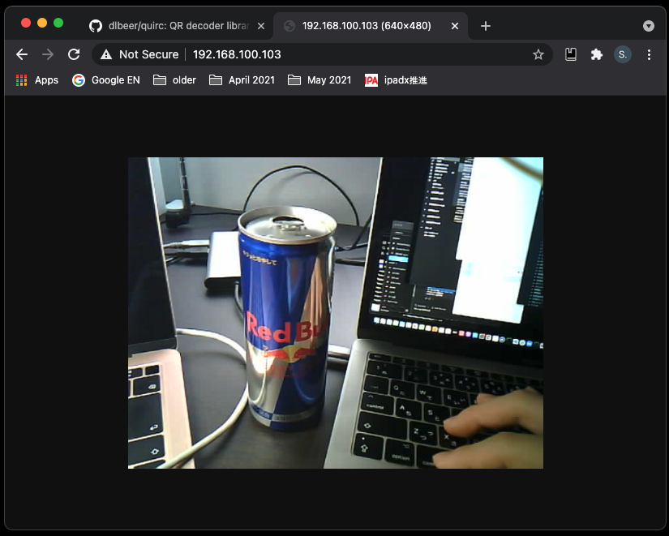

# ESP32-CAM HTTP Camera

HTTPでカメラ画像を取得

## Demo



## Usage

1. Arduino Studio が無ければインストール

2. Arduino Studio に Arduino core for the ESP32 をインストール
   https://github.com/espressif/arduino-esp32

3. wifi_config.h を作成

   ```
   const char *ssid = "damedame";
   const char *password = "minaide";
   ```

4. Arduino Studio で `http_camera.ino` を開き、書き込み

